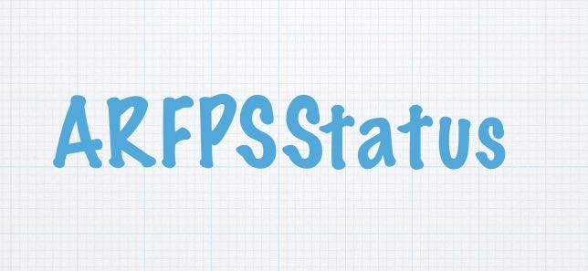
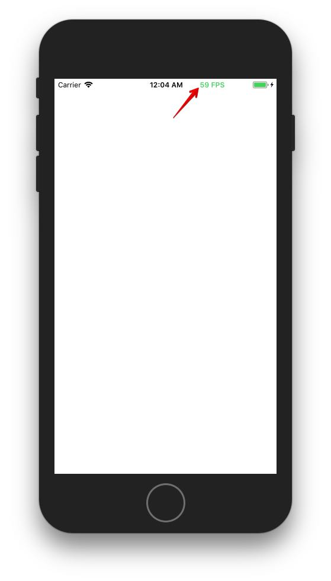

ARFPSStatus
---------------

**ARFPSStatus** 是Swift的版本的用来显示FPS状态在iOS状态栏的简单库，FPS(Frame Per Second)是一秒钟渲染多少帧的意思。一般FPS小于60人眼就会感觉不连贯、卡顿。FPS的值最佳为60左右。

### 使用
在`application(_:willFinishLaunchingWithOptions:)`方法中添加：

```
ARFPSStatus.shared.open()
```

或
```
ARFPSStatus.shared.openWithHandler { (fpsValue) in
     print("fpsValue \(fpsValue)")
}
```

不需要时，关闭：
```
ARFPSStatus.shared.close()
```


